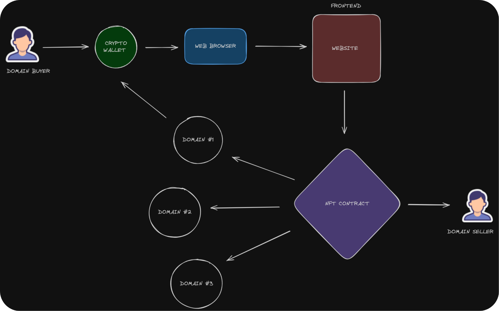

# Web3Domains

Web3Domains is a decentralized domain name service built on the Ethereum blockchain, providing a secure and censorship-resistant way to manage domains and online identities. With Web3Domains, users have true ownership and control over their domain names, represented as non-fungible tokens (NFTs) on the Ethereum network.



The flowchart above illustrates the end-to-end process of registering and resolving a domain name using the Web3Domains service.

## Features

- **Decentralized Ownership**: Domain names are minted as ERC-721 NFTs, giving users full control and ownership of their online identities.
- **Censorship Resistance**: No central authority can seize, revoke, or censor your domain name.
- **Immutable Records**: Domain ownership and resolution data are stored on the tamper-proof Ethereum blockchain.
- **Flexible Resolution**: Domains can resolve to Ethereum addresses, IPFS content hashes, and other identifiers beyond traditional DNS.
- **Subdomain Support**: Users can create and manage subdomains under their primary domain.

## Tech Stack

- **Solidity**: Smart contracts for domain registration, ownership, and resolution logic.
- **JavaScript**: Frontend application built with React.js and Ethers.js for blockchain interaction.
- **Hardhat**: Ethereum development environment for compiling, testing, and deploying smart contracts.

## Getting Started

### Requirements

- [Node.js](https://nodejs.org/en/) (version 12 or later)
- [NPM](https://www.npmjs.com/) (comes bundled with Node.js)

### Installation

1. Clone the repository:

```bash
git clone https://github.com/web3domains/web3domains.git
```

2. Install dependencies:

```bash
cd web3domains
npm install
```

### Running Locally

1. Start a local Ethereum node:

```bash
npx hardhat node
```

2. Deploy the smart contracts:

```bash
npx hardhat run scripts/deploy.js --network localhost
```

3. Start the React frontend:

```bash
npm start
```

The application should now be running at `http://localhost:3000`.

### Testing

Run automated tests with Hardhat:

```bash
npx hardhat test
```

## Demonstrating the Process with MetaMask

Using MetaMask, a popular Ethereum wallet and browser extension, simplifies the interaction with Web3Domains. Here’s a step-by-step demonstration of the process:

1. **Install MetaMask**: Ensure you have MetaMask installed and set up in your browser.

2. **Connect MetaMask to Web3Domains**:
   - Open the Web3Domains application.
   - Click on the "Connect Wallet" button and select MetaMask.
   - Approve the connection in the MetaMask popup.

3. **Register a Domain**:
   - Navigate to the domain registration section.
   - Enter the desired domain name and submit the registration request.
   - Confirm the transaction in MetaMask. Once the transaction is confirmed on the blockchain, the domain is minted as an NFT and assigned to your Ethereum address.